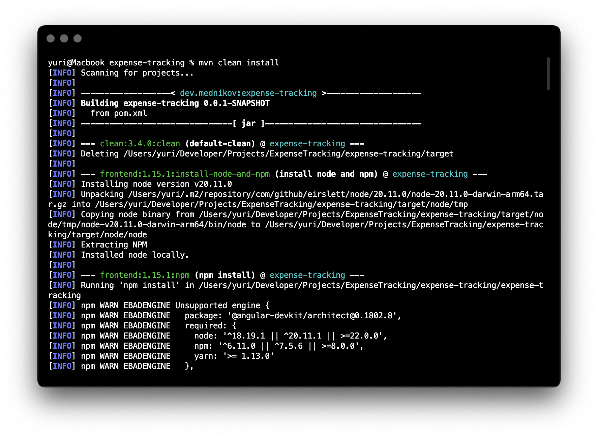
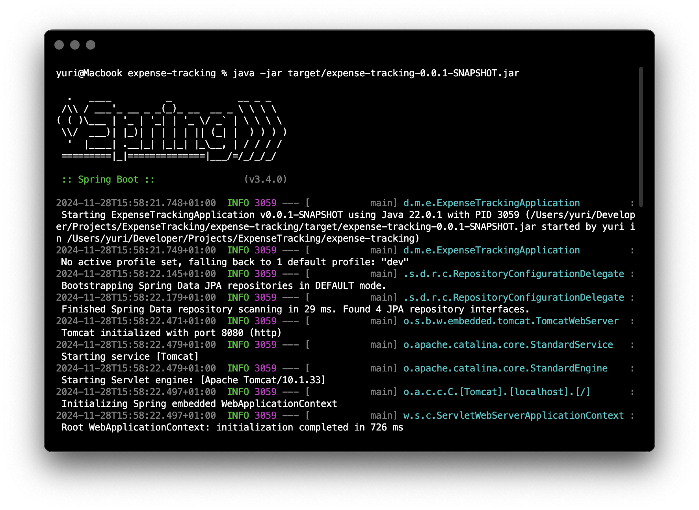
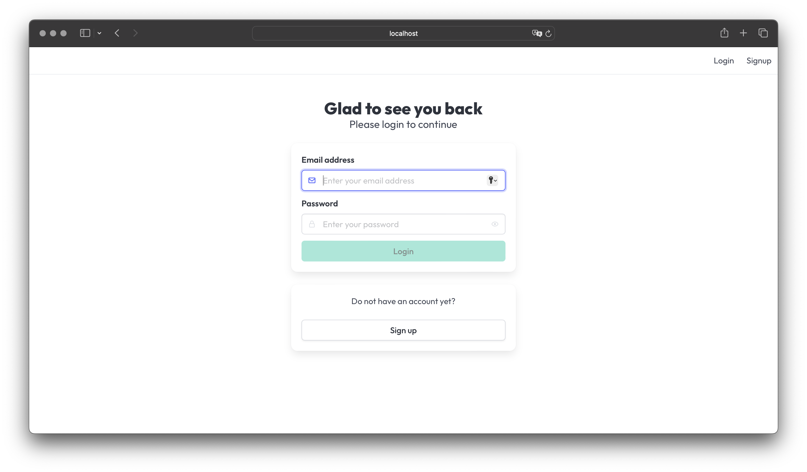

# Expense tracking application


The application “Expense tracking” can be used by users in order to track personal finance situation: expenses and income, as well operations across various accounts (bank cards, cash etc.)

## Project description

The target audience of this project are people who want to track their expenses and income and have an overview of the current financial situation. They are not satisfied by existing solutions and want to have more clear and user-friendly interface and synchronization between different devices (web, mobile). The usage of the project provides following of benefits: operations are categorized and recorded in a clear manner; different reports are generated to present an actual situation etc.

From a domain driven design perspective, the application is divided into 5 core domains: Users, Payment accounts, Categories, Operations, and Currencies.

## How to run the project

The application is a standard Java application that is packaged as fat jar and therefore can run on any environment where you can install Java (local, popular PaaS solutions, any cloud server).

System requirements are:

- Java JDK v.24+
- PostgreSQL server v.16+

This section describes how to run application using the development configuration (for local testing) and the production configuration

### Quick run

In order to quickly run the application locally:

1. Create the PostgreSQL database
    - Database name ```expense_tracking_db```
    - Username ```expense_tracking_user```
    - Password: ```secret```
2. Open terminal and navigate to the root folder of the project
3. Run Maven to generate a fat jar
    - If you have a local Maven installation: ```mvn clean install```
    - If you do not have a local Maven installation: ```./mvnw clean install```



4. Run the fat jar ```java -jar target/expense-tracking-0.0.1-SNAPSHOT.jar```



5. Open your browser and navigate to ```http://localhost:8080```



### Run in a production mode

The previous section shows how to quickly get the application up and running. If you want to run the application in _production mode_ (for example, deploy it to the VPS), you need to run the ```prod``` profile.

In order to do this please first set following environment variables:

- ```DATABASE_URL``` = the [jdbc url](https://docs.oracle.com/javase/tutorial/jdbc/basics/connecting.html) to the PostgreSQL database
- ```DATABASE_USER```= the database username 
- ```DATABASE_PASSWORD``` = the database password 
- ```FLYWAY_USER``` = the username used by Flyway to run migrations
- ```FLYWAY_SECRET``` = the password used by Flyway to run migrations
- ```HTTP_PORT``` = the HTTP port number for the application server

Once all these values are provided, the same sequence of steps applies:

1. Navigate to the root folder for the project
2. Run Maven to generate a fat jar
   - If you have a local Maven installation: ```mvn clean install```
   - If you do not have a local Maven installation: ```./mvnw clean install```
3. Run the fat jar ```java -Dspring.profiles.active=prod -jar target/expense-tracking-0.0.1-SNAPSHOT.jar```
4. Open your browser and navigate to ```http://localhost:{YourPortNumber}```

## Android Application

This project has a companion Android application. This app is also an academic project, and I made a decision to leverage existing complex backend to be able to showcase advanced features in the app.

You can check the Android app in [this github repository](https://github.com/mdnkv/expense-tracking-app)

## Author

(C) 2024-2026 Iurii Mednikov <iurii.mednikov@iu-study.org>

The code is delivered under terms of the MIT software license. For more information, check the ```LICENSE.txt``` file.